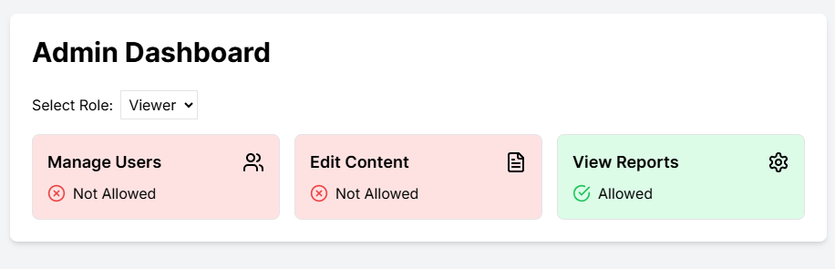

# Permit NextJS Dashboard



This project demonstrates a simple implementation of Role-Based Access Control (RBAC) in a Next.js application, inspired by the Permit.io integration. It showcases how different user roles (admin, editor, viewer) can have varying levels of access to features in an admin dashboard.

## Getting Started

First, clone the repository

```bash
git clone https://github.com/Tabintel/permit-nextjs-dashboard.git
```

Install dependencies:

```bash
npm install
```

Then run the development server:

```bash
npm run dev
# or
yarn dev
# or
pnpm dev
# or
bun dev
```